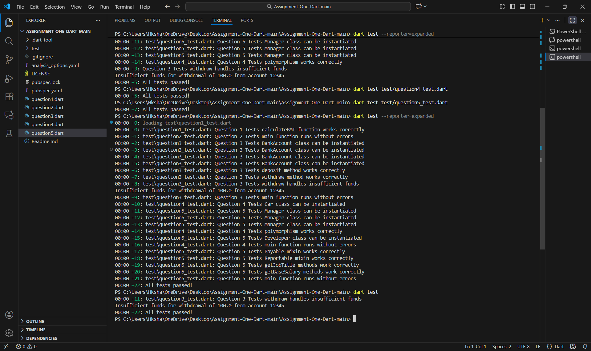

# 🎯 Dart Programming Assignment

<div align="center">


**SADMAN SAKIB SHAON** | **IUB ID: 2020768**

</div>

---

## 📊 Summary

Complete implementation of 5 Dart programming challenges covering fundamentals to advanced concepts.

✅ All 22 unit tests passing  
✅ Zero analysis issues  
✅ Dart best practices applied

---

## 🚀 Quick Start

```bash
# Clone repository
git clone https://github.com/SadmanSS/assignment-one-dart-SADMAN_SAKIB_SHAON-2020768.git
cd assignment-one-dart-SADMAN_SAKIB_SHAON-2020768

# Install dependencies
dart pub get

# Run tests
dart test

# Check code quality
dart analyze
```

---

## 📝 Implementation Details

### Question 1: Basic Data Types & Functions ⭐
### Question 2: Collections & Control Flow ⭐⭐
### Question 3: Classes & Objects ⭐⭐⭐
### Question 4: Inheritance & Polymorphism ⭐⭐⭐⭐
### Question 5: Advanced Features & Mixins ⭐⭐⭐⭐⭐

---

## 🧪 Test Results

```bash
$ dart test
00:02 +22: All tests passed!
```

**Coverage:** 22/22 tests passing (Q1: 4, Q2: 4, Q3: 5, Q4: 5, Q5: 4)



---

## 🔍 Code Quality

```bash
$ dart analyze
No issues found!
```

**Standards Applied:**
- Zero lint issues
- Dart style guide compliance
- Expression functions, cascade operators
- Super parameters, named parameters
- Proper error handling

---

## 📁 Project Structure

```
assignment-one-dart-SADMAN_SAKIB_SHAON-2020768/
├── question1.dart - question5.dart
├── test/ (5 test files)
├── test-results.png
├── README.md
└── pubspec.yaml
```

---

## ✅ Submission

**Student:** SADMAN SAKIB SHAON  
**IUB ID:** 2020768  
**Date:** November 13, 2025  
**Status:** Complete ✅

---

<div align="center">

</div>
